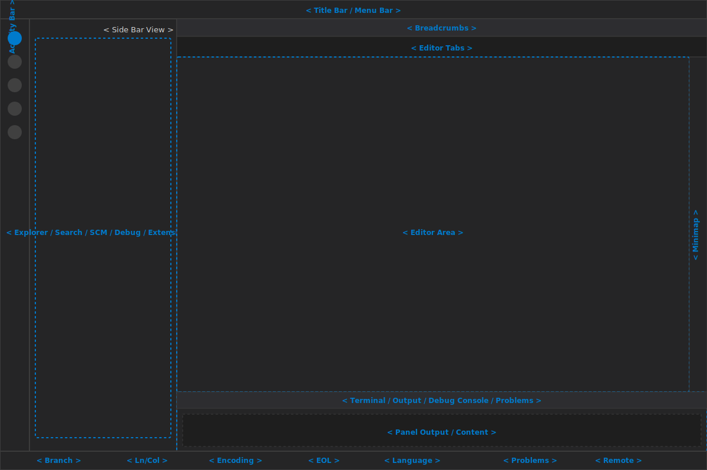

# VS Code UI Elements

This document enumerates the main Visual Studio Code user interface elements, with a short description and the default location in the window layout.

## 1. Window Layout

- Editor Group / Editor Area
  - Description: The primary text editing surface for files and editors.
  - Default location: Center of the window.
- Side Bar
  - Description: Hosts views such as Explorer, Search, Source Control, Run, and Extensions.
  - Default location: Left side of the window.
- Activity Bar
  - Description: Vertical toolbar for switching between major side bar view containers.
  - Default location: Far left edge of the window.
- Status Bar
  - Description: Persistent footer showing file status, branch, encoding, and other indicators.
  - Default location: Bottom edge of the window.
- Panel
  - Description: Bottom or right-aligned panel for Terminal, Output, Debug Console, and Problems.
  - Default location: Bottom by default; can move to the right.
- Title Bar
  - Description: Window title and application control buttons.
  - Default location: Top edge of the window.
- Menu Bar (platform-dependent)
  - Description: Global application menu for File, Edit, Selection, View, Go, Run, Terminal, and Help.
  - Default location: Top edge of the window on macOS and Windows; may be hidden on Linux.
- Command Palette
  - Description: Keyboard-driven command entry for actions and settings.
  - Default location: Overlay centered near the top of the window.
- Editor Tabs
  - Description: Tabs for open files and editors.
  - Default location: Top of the Editor Area.
- Breadcrumbs
  - Description: Path navigation for the current file and symbols.
  - Default location: Above the Editor Area.
- Editor Groups / Split Editors
  - Description: Multiple editors arranged side-by-side or stacked.
  - Default location: Center, within the Editor Area.
- Minimap
  - Description: A compact overview of the source file on the right edge of the Editor Area.
  - Default location: Right side of the Editor Area.
- Zen Mode / Fullscreen Mode
  - Description: Modes that hide UI chrome for distraction-free editing.
  - Default location: Full window.
- Notification Toasts
  - Description: Temporary popups for alerts, warnings, and info messages.
  - Default location: Upper right by default.

## 2. Activity Bar

- Explorer icon
  - Description: Opens the Explorer view for workspace files.
  - Default location: Top of the Activity Bar.
- Search icon
  - Description: Opens the Search view for text search across the workspace.
  - Default location: Below Explorer in the Activity Bar.
- Source Control icon
  - Description: Opens Git / source control view.
  - Default location: Below Search in the Activity Bar.
- Run and Debug icon
  - Description: Opens the Run & Debug view.
  - Default location: Below Source Control in the Activity Bar.
- Extensions icon
  - Description: Opens the Extensions marketplace and installed extensions list.
  - Default location: Below Run and Debug in the Activity Bar.

## 3. Side Bar Views

- Explorer view
  - Description: File tree and folder navigation for the current workspace.
  - Default location: Side Bar, left side.
- Search view
  - Description: Text search interface with filters and replace.
  - Default location: Side Bar, left side.
- Source Control view
  - Description: Git change staging, diff preview, and commit operations.
  - Default location: Side Bar, left side.
- Run view
  - Description: Debugging controls, configurations, breakpoints, and call stack access.
  - Default location: Side Bar, left side.
- Extensions view
  - Description: Install, enable, disable, and configure extensions.
  - Default location: Side Bar, left side.

## 4. Panel and Status UI

- Terminal panel
  - Description: Integrated terminal shell.
  - Default location: Bottom panel.
- Output panel
  - Description: Output logs from tasks, extensions, and VS Code services.
  - Default location: Bottom panel.
- Debug Console panel
  - Description: Debug output and expression evaluation.
  - Default location: Bottom panel.
- Problems panel
  - Description: Issues list with quick navigation.
  - Default location: Bottom panel.
- Branch / Git status indicator
  - Description: Shows current Git branch and sync status.
  - Default location: Bottom left of the Status Bar.
- Line/column position
  - Description: Displays cursor line and column numbers.
  - Default location: Bottom right of the Status Bar.
- Encoding selector
  - Description: Shows file text encoding and lets you change it.
  - Default location: Bottom right of the Status Bar.

## 5. Editor Components

- Inline error/warning decorations
  - Description: Squiggles and gutter icons for diagnostics.
  - Default location: Inside the Editor Area.
- Code lens
  - Description: Inline actionable commands above code blocks.
  - Default location: Inside the Editor Area.
- Peek view / inline peek editor
  - Description: Temporary inline editor for references and definitions.
  - Default location: Overlaid within the Editor Area.
- Diff editor
  - Description: Side-by-side or inline comparison of changes.
  - Default location: Editor Area.

---

This document is designed for a cleaner preview and references the main VS Code interface elements with a single layout illustration.
