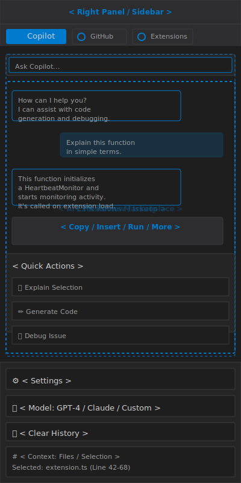

# VS Code UI Elements

This document enumerates the main Visual Studio Code user interface elements, with a short description and the default location in the window  layout.

## 1. Window Layout

- Editor Group / Editor Area
  - Description: The main workspace where you write and edit code. Supports multiple files, split panes, and custom layouts. Click on file tabs to switch between open files, or drag tabs to reorganize. Use Cmd+\ to split the editor horizontally.
  - Default location: Center of the window, occupying most of the space.
- Side Bar
  - Description: Context-sensitive panel that switches between views based on the selected Activity Bar icon. Displays file explorer, search results, git changes, debug controls, or extensions depending on your current workflow. Collapsible to maximize editor space.
  - Default location: Left side of the window, directly right of the Activity Bar.
- Activity Bar
  - Description: Icon-based navigation for primary VS Code views. Each icon toggles a different side view (Explorer, Search, Source Control, Run/Debug, Extensions). The blue highlight indicates the currently active view. Click or Ctrl+B to toggle visibility.
  - Default location: Far left vertical strip of the window.
- Status Bar
  - Description: Footer bar displaying real-time editor information including cursor position, file encoding, line endings (CRLF/LF), language mode, error/warning count, and remote connection status. Click any item to change settings. Shows active language-specific tools and extensions.
  - Default location: Bottom edge of the window, spanning full width.
- Panel
  - Description: Collapsible workspace for background operations and logs. Houses Terminal (command shell), Output (task/extension logs), Debug Console (debugger REPL), and Problems (errors/warnings). Can be positioned bottom or right side. Toggle with Ctrl+J.
  - Default location: Bottom of the window by default; draggable to the right side.
- Title Bar
  - Description: Window chrome containing the application name, current file name, and OS-level window controls (minimize, maximize, close). On Linux, the menu bar may appear here. Shows unsaved file indicators (dot/circle on filename).
  - Default location: Top edge of the window.
- Menu Bar (platform-dependent)
  - Description: Traditional dropdown menus for File, Edit, Selection, View, Go, Run, Terminal, and Help. Access to preferences, commands, and keyboard shortcuts. Hidden by default on Linux and can be toggled on all platforms via View menu.
  - Default location: Top edge on macOS and Windows; integrated into title bar or hidden on Linux.
- Command Palette
  - Description: Powerful overlay for searching and executing any command, action, or setting by name. Press Cmd+Shift+P to open. Type to filter results. Shows keyboard shortcuts for each command. Essential for quick access without navigating menus.
  - Default location: Overlay centered near the top of the window (modal dialog).
- Editor Tabs
  - Description: Tab strip showing all currently open files. Left-click to switch, middle-click to close, right-click for context menu. Unsaved files show a dot indicator. Supports drag-and-drop reordering and tab pinning for important files.
  - Default location: Top of the Editor Area, below breadcrumbs.
- Breadcrumbs
  - Description: Hierarchical navigation path showing file location and current symbol (function, class, method). Click any segment to jump to that location. Useful for understanding nested code structure. Can be toggled via View menu.
  - Default location: Above the Editor Area, between tabs and editor content.
- Editor Groups / Split Editors
  - Description: Split the editor into multiple panes for side-by-side editing. Create vertical (Cmd+\) or horizontal splits (Cmd+K, Cmd+\). Each pane is independent with its own scroll position and selection. Drag tabs between groups to move files.
  - Default location: Center of the Editor Area; layout depends on user configuration.
- Minimap
  - Description: Scrollable code overview on the right edge showing the entire file at reduced scale. Provides quick visual navigation; click or drag to jump to specific locations. Useful for large files. Toggle via View > Toggle Minimap.
  - Default location: Right edge of the Editor Area (ultra-thin strip).
- Zen Mode / Fullscreen Mode
  - Description: Distraction-free editing modes that hide all UI except the editor. Zen Mode (Cmd+K, Z) hides side bar and panel; Fullscreen (F11) uses the entire screen. Exit by pressing Escape or clicking the exit button.
  - Default location: Full window; replaces normal layout.
- Notification Toasts
  - Description: Non-modal alerts for system messages, warnings, errors, and extension notifications. Auto-dismiss after a few seconds or click the X to close. Multiple toasts stack vertically. Click the notification to perform related actions.
  - Default location: Upper right corner by default, can appear bottom-right on some systems.

## 2. Activity Bar

- Explorer icon
  - Description: Opens the file tree view for navigating and managing workspace folders. Shows project structure with expand/collapse folder controls. Right-click files to access context menu (create, delete, rename, copy path). Keyboard: Ctrl+B toggles the sidebar.
  - Default location: Top of the Activity Bar (usually highlighted when opening VS Code).
- Search icon
  - Description: Full-text search across all workspace files. Type search terms to find matches with line context. Use regex patterns (toggle icon), case sensitivity, and whole-word matching. Shows count of matches. Keyboard: Ctrl+Shift+F for workspace search.
  - Default location: Second icon in the Activity Bar, below Explorer.
- Source Control icon
  - Description: Git and version control operations. Shows changed files in two sections (Changes and Staged Changes). Stage/unstage files, write commit messages, push/pull code, and switch branches from this view. Integrates with all major version control systems.
  - Default location: Third icon in the Activity Bar.
- Run and Debug icon
  - Description: Launch debug sessions, manage breakpoints, inspect variables and call stack during execution. Create debug configurations for different environments (Node, Python, etc.). Set breakpoints by clicking line numbers. Keyboard: F5 starts debugging.
  - Default location: Fourth icon in the Activity Bar.
- Extensions icon
  - Description: Browse and manage VS Code extensions. Search marketplace, view installed extensions, check for updates, enable/disable, or uninstall. Read extension details, ratings, and reviews. Keyboard: Ctrl+Shift+X opens Extensions view.
  - Default location: Fifth icon in the Activity Bar.

## 3. Side Bar Views

- Explorer view
  - Description: Hierarchical file and folder tree for the entire workspace. Expand/collapse folders with arrow icons. Double-click files to open them in the editor. Drag-and-drop support for file organization. Search files within the explorer using the search box. Context menu (right-click) for create, delete, rename, and other file operations.
  - Default location: Side Bar, visible when Explorer icon is active.
- Search view
  - Description: Advanced text search UI with multiple options. Find across files, navigate matches with arrows, replace one or all occurrences. Toggle regex, case sensitivity, and whole-word matching with icons. Clear history button to reset previous searches. Shows file and line-number context for each match.
  - Default location: Side Bar, replaces explorer when Search icon is active.
- Source Control view
  - Description: Manage version control operations for Git or other providers. Lists all modified files in two sections: Unstaged and Staged changes. Shows branch name and sync status. Type commit messages in the message box. Includes shortcuts for discard, stash, and sync operations.
  - Default location: Side Bar, replaces explorer when Source Control icon is active.
- Run view
  - Description: Debugging and execution controls. Displays debug configurations dropdown, launch/pause/stop buttons, and debugging variables panel. Shows call stack, local/global variables, watches, and breakpoints in collapsible sections. Supports conditional breakpoints and expression evaluation.
  - Default location: Side Bar, visible when Run and Debug icon is active.
- Extensions view
  - Description: Browse installed extensions and the VS Code marketplace. Filter by category (themes, debuggers, language support, etc.). Each extension shows install count, ratings, and detailed description. Action buttons to install, enable, disable, or configure each extension.
  - Default location: Side Bar, visible when Extensions icon is active.

## 4. Panel and Status UI

- Terminal panel
  - Description: Integrated shell (bash, zsh, PowerShell, etc.) for running commands without leaving VS Code. Multiple terminals can be opened in tabs. Supports drag-and-drop file paths, clearing history, and splitting the terminal pane. Toggle with Ctrl+`.
  - Default location: Bottom panel; displays output from commands and shell prompts.
- Output panel
  - Description: Logs from running tasks, build processes, and extensions. Shows timestamped messages with color coding for errors, warnings, and info. Useful for debugging build scripts and monitoring long-running tasks. Auto-scrolls to latest output.
  - Default location: Bottom panel, accessible via tab at the panel top.
- Debug Console panel
  - Description: REPL interface for evaluating expressions during debugging. Shows debug output and evaluation results. Type expressions to inspect variable values. Supports autocomplete. Essential for runtime debugging without stopping the debugger.
  - Default location: Bottom panel, accessible via tab.
- Problems panel
  - Description: Centralized list of all errors and warnings in the workspace. Double-click any problem to jump to its location in the editor. Filter by file, type (error/warning), or search text. Shows problem source and quick fix suggestions where available.
  - Default location: Bottom panel, accessible via tab.
- Branch / Git status indicator
  - Description: Shows the current Git branch name and sync state (ahead/behind). Click to open branch picker and switch branches. Displays notification badge if commits are pending sync. Icon changes based on connection status (clean, dirty, syncing).
  - Default location: Bottom left of the Status Bar, usually first item.
- Line/column position
  - Description: Displays the cursor's current line and column position. Format: "Ln X, Col Y". Click to open "Go to Line" dialog for quick navigation. Updates in real-time as cursor moves or selection changes.
  - Default location: Bottom right of the Status Bar (right-center area).
- Encoding selector
  - Description: Shows the current file's text encoding (UTF-8, ISO-8859-1, etc.). Click to change encoding if the file is not displaying correctly or to save with a different encoding. Essential for handling legacy files or international content.
  - Default location: Bottom right of the Status Bar.

## 5. Editor Components

- Inline error/warning decorations
  - Description: Red squiggly underlines (errors) and orange squiggles (warnings) appear under problematic code. Gutter icons on the left margin indicate problem locations. Hover over squiggles to see error messages. Click the lightbulb icon to view quick fixes and code actions.
  - Default location: Directly inline within the editor text where issues occur.
- Code lens
  - Description: Clickable inline text above functions, classes, and other definitions showing helpful information like "X references" or "Run | Debug" for test functions. Provided by language servers and extensions. Click to jump to references or execute actions. Toggle via editor.codeLens setting.
  - Default location: Above code blocks and function definitions in the editor.
- Peek view / inline peek editor
  - Description: Shows a temporary inline editor window displaying definition or reference without navigating away. Keyboard: Alt+F12 for definitions, Shift+Alt+F12 for references. Close with Escape. Supports split and navigation between multiple results.
  - Default location: Appears inline within the editor when triggered by "Peek Definition" or "Peek References" commands.
- Diff editor
  - Description: Side-by-side comparison of two files showing added (green), removed (red), and modified (blue) lines. Supports inline editing on either side. Keyboard: Use arrow keys to navigate between changes. Useful for reviewing changes before committing or merging branches.
  - Default location: Main Editor Area, displayed when comparing files or viewing git diffs.

## 6. Right Panel / AI Tools

- Copilot Chat Panel
  - Description: GitHub Copilot's interactive chat interface for conversational AI assistance. Ask questions about code, get explanations, generate snippets, debug issues. Features chat history, quick actions, and context awareness of your current selection.
  - Key interactions: Type questions in the input field; click action buttons to copy/insert/run responses; use context menu to include file selection or current line.
  - Default location: Right sidebar panel, accessible via Copilot icon or Cmd+Shift+I.

- Chat Message Area
  - Description: Displays conversation history with alternating AI and user messages. AI responses are left-aligned in darker boxes; user messages are right-aligned in blue boxes. Shows inline code blocks with syntax highlighting and runnable code actions.
  - Default location: Center of the right panel, scrollable for long conversations.

- Quick Action Buttons
  - Description: Context-aware action buttons below AI responses (Copy, Insert, Run, More). Copy sends response to clipboard; Insert adds code to editor; Run executes code snippets; More opens additional options like "Explain" or "Refactor".
  - Default location: Below each AI-generated response in the chat area.

- Settings & Configuration
  - Description: Bottom section of right panel showing AI model selector (GPT-4, Claude, Custom), clear history button, and context indicators. Shows which files or code selections are being used as context for AI responses.
  - Default location: Bottom of the right panel with expandable sections.

- Tab Navigation (Copilot / GitHub / Extensions)
  - Description: Tab bar at the top of the right panel for switching between Copilot Chat, GitHub integration (PR reviews, issues), and AI Extensions marketplace. Active tab is highlighted; icons indicate panel type.
  - Default location: Top of the right sidebar below the panel header.

---

This document is designed for a cleaner preview and references the main VS Code interface elements with layout illustrations for both the main window and right-side AI tools panel.
